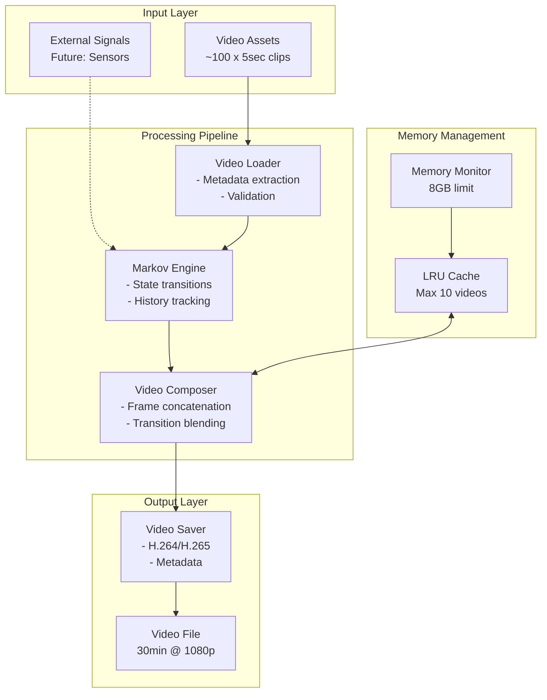

# PLANNING.md - Non-Linear Video Avatar ComfyUI Nodes

## Vision Statement

### Project Vision
Transform static, repetitive video loops into dynamic, lifelike avatars that maintain viewer engagement for extended periods (30+ minutes) through intelligent sequencing, creating a new standard for digital presence and avatar systems in ComfyUI.

### Core Innovation
Replace predictable A→B→C→A loop patterns with sophisticated Markov chain-based transitions that create emergent, non-repetitive behavior from a finite set of video assets, making avatars appear more conscious and alive.

### Long-term Goal
Establish a foundation for responsive, context-aware avatars that can react to external stimuli (cameras, sensors, user input) while maintaining natural, non-repetitive behavior patterns.

---

## System Architecture

### High-Level Architecture

```
┌─────────────────────────────────────────────────────────────┐
│                     ComfyUI Interface                        │
├─────────────────────────────────────────────────────────────┤
│                    Custom Node Layer                         │
│  ┌──────────┐  ┌──────────┐  ┌──────────┐  ┌──────────┐  │
│  │  Asset   │→ │  Markov  │→ │ Composer │→ │  Saver   │  │
│  │  Loader  │  │Sequencer │  │          │  │          │  │
│  └──────────┘  └──────────┘  └──────────┘  └──────────┘  │
├─────────────────────────────────────────────────────────────┤
│                      Core Engine Layer                       │
│  ┌────────────────┐  ┌─────────────┐  ┌────────────────┐  │
│  │ Markov Engine  │  │Memory Manager│  │ Video Processor│  │
│  └────────────────┘  └─────────────┘  └────────────────┘  │
├─────────────────────────────────────────────────────────────┤
│                    Infrastructure Layer                      │
│  ┌────────┐  ┌────────┐  ┌────────┐  ┌────────────────┐  │
│  │ OpenCV │  │ FFmpeg │  │ NumPy  │  │ File System    │  │
│  └────────┘  └────────┘  └────────┘  └────────────────┘  │
└─────────────────────────────────────────────────────────────┘
```

### Component Architecture



### Data Flow Architecture

```
1. Asset Loading Phase
   ├─ Scan directory for video files
   ├─ Extract metadata (duration, fps, resolution)
   ├─ Compute visual features for similarity
   └─ Validate seamless loop points

2. Sequence Generation Phase
   ├─ Initialize Markov transition matrix
   ├─ Set random seed for reproducibility
   ├─ Generate state sequence for target duration
   │  ├─ Select next state (prevent repetition)
   │  ├─ Apply history penalty
   │  └─ Record transition
   └─ Output ordered sequence

3. Composition Phase
   ├─ Batch load videos (10 at a time)
   ├─ Extract frames from each video
   ├─ Concatenate frames in sequence order
   ├─ Apply transition blending (optional)
   └─ Stream to output buffer

4. Output Phase
   ├─ Encode video stream (H.264/H.265)
   ├─ Add metadata tags
   └─ Save to file system
```

---

## Technology Stack

### Core Technologies

| Layer | Technology | Version | Justification |
|-------|------------|---------|---------------|
| **Platform** | ComfyUI | Latest | Target platform for custom nodes |
| **Language** | Python | 3.10+ | ComfyUI native, extensive libraries |
| **Video Processing** | OpenCV | 4.8.0+ | Industry standard, efficient frame handling |
| **Encoding** | FFmpeg | 5.0+ | Best codec support, streaming capabilities |
| **Numerical** | NumPy | 1.24+ | Fast array operations, Markov calculations |
| **Scientific** | SciPy | 1.10+ | Visual similarity metrics, statistics |
| **ML/Features** | scikit-learn | 1.3+ | Feature extraction for visual similarity |

### Architecture Decisions

#### Why Python?
- **Native to ComfyUI**: Direct integration without bridges
- **Library ecosystem**: Comprehensive video/ML libraries
- **Memory management**: GC and explicit control options
- **Rapid development**: Fast iteration for algorithm tuning

#### Why OpenCV + FFmpeg?
- **OpenCV**: Frame-level manipulation, format support
- **FFmpeg**: Production-quality encoding, streaming
- **Combination**: OpenCV for processing, FFmpeg for output

#### Why Markov Chains?
- **Proven stochastic model**: Well-understood mathematics
- **Configurable complexity**: From uniform to learned transitions
- **Memory efficient**: Only requires transition matrix
- **Extensible**: Can incorporate external signals

### Performance Optimizations

```python
# Key Performance Strategies

1. Batch Processing
   - Load max 10 videos simultaneously
   - Process frames in chunks of 1000
   - Use numpy vectorization

2. Memory Management
   - LRU cache with 10-video limit
   - Aggressive garbage collection
   - Stream large outputs to disk

3. Parallel Processing
   - Feature extraction in parallel
   - Independent video loading threads
   - Async FFmpeg encoding

4. Caching Strategy
   - Cache video metadata
   - Pre-compute transition matrix
   - Reuse visual features
```

---

## Required Tools & Environment

### Development Environment

```yaml
# development_setup.yaml

Operating System:
  - Windows 10/11 (primary)
  - Linux (Ubuntu 20.04+)
  - macOS (12.0+)

Python Environment:
  version: "3.10 or 3.11"
  package_manager: pip
  virtual_env: venv or conda
  
GPU Requirements:
  minimum: GTX 1660 (6GB VRAM)
  recommended: RTX 3060 (12GB VRAM)
  cuda: "11.8 or 12.1"
  
RAM Requirements:
  minimum: 16GB
  recommended: 32GB
  available_for_process: 8GB
```

### Required Software Tools

#### Essential Tools
```bash
# Core Development
1. Python 3.10+ with pip
2. Git for version control
3. ComfyUI (latest stable)
4. CUDA Toolkit 11.8+ (for GPU acceleration)

# Video Tools
5. FFmpeg 5.0+ (system-wide installation)
   - Windows: Download from ffmpeg.org
   - Linux: sudo apt install ffmpeg
   - macOS: brew install ffmpeg

6. Video codec libraries
   - libx264 (H.264 encoding)
   - libx265 (H.265 encoding)
   - libvpx (VP9 encoding)
```

#### Python Dependencies
```txt
# requirements.txt with exact versions

# Core Processing
numpy==1.24.3
opencv-python==4.8.1.78
opencv-contrib-python==4.8.1.78

# Video Encoding
ffmpeg-python==0.2.0
imageio==2.31.5
imageio-ffmpeg==0.4.9

# Scientific Computing
scipy==1.11.4
scikit-learn==1.3.2
scikit-image==0.22.0

# Utilities
tqdm==4.66.1
pillow==10.1.0
matplotlib==3.8.2

# Development Tools
pytest==7.4.3
pytest-cov==4.1.0
black==23.11.0
pylint==3.0.3
mypy==1.7.1
```

### Development Tools

#### IDE/Editor Setup
```yaml
Recommended IDEs:
  - VSCode with Python extension
  - PyCharm Professional
  - Sublime Text with Anaconda package

VSCode Extensions:
  - Python (ms-python.python)
  - Pylance (ms-python.vscode-pylance)
  - Python Docstring Generator
  - GitLens
  - Better Comments
  - Python Test Explorer

Settings (.vscode/settings.json):
  {
    "python.linting.enabled": true,
    "python.linting.pylintEnabled": true,
    "python.formatting.provider": "black",
    "python.testing.pytestEnabled": true,
    "editor.formatOnSave": true,
    "editor.rulers": [88]
  }
```

#### Testing Tools
```bash
# Unit Testing
pytest                 # Test framework
pytest-cov            # Coverage reporting
pytest-mock           # Mocking support
pytest-benchmark      # Performance testing

# Integration Testing
ComfyUI Test Server   # Local ComfyUI instance
Selenium             # Workflow automation
Postman              # API testing

# Performance Testing
memory_profiler      # Memory usage analysis
line_profiler       # Line-by-line profiling
py-spy              # Sampling profiler
```

### Asset Preparation Tools

#### Video Creation/Editing
```yaml
Professional Tools:
  - Adobe After Effects (seamless loops)
  - DaVinci Resolve (color grading)
  - Blender (3D avatar creation)

Open Source Tools:
  - OpenShot (basic editing)
  - Kdenlive (Linux-friendly)
  - Shotcut (cross-platform)

Validation Tools:
  - MediaInfo (metadata inspection)
  - FFprobe (format validation)
  - VLC (playback testing)
```

#### Asset Requirements
```yaml
Video Specifications:
  format: MP4 (H.264)
  resolution: 1920x1080 (recommended)
  fps: 30 or 60
  duration: 3-7 seconds (5 ideal)
  compression: CRF 18-23
  color_space: sRGB
  seamless: First and last frames must match
  
Naming Convention:
  pattern: "avatar_{category}_{number:03d}.mp4"
  examples:
    - avatar_idle_001.mp4
    - avatar_talking_023.mp4
    - avatar_gesture_045.mp4
```

---

## System Integration Points

### ComfyUI Integration

```python
# Integration Architecture

1. Node Registration
   location: ComfyUI/custom_nodes/ComfyUI-NonLinearVideoAvatar/
   entry: __init__.py
   registry: NODE_CLASS_MAPPINGS

2. Type System Integration
   custom_types: ["VIDEO_METADATA_LIST", "VIDEO_SEQUENCE"]
   registration: __init__.py
   compatibility: Ensure serializable

3. Execution Model
   mode: Lazy evaluation
   caching: Leverage ComfyUI's result caching
   threading: Respect ComfyUI's execution context

4. UI Integration
   menu_category: "video/avatar"
   node_colors: Follow ComfyUI conventions
   preview: Thumbnail generation for UI
```

### External System Integration (Future)

```yaml
Phase 2 - Sensor Integration:
  Webcam Input:
    - Face detection (OpenCV/dlib)
    - Emotion recognition (FER)
    - Gesture tracking (MediaPipe)
  
  Audio Input:
    - Voice activity detection
    - Amplitude analysis
    - Speech recognition (optional)
  
  Network Input:
    - WebSocket messages
    - OSC protocol
    - MQTT events

Phase 3 - AI Integration:
  LLM Integration:
    - ChatGPT API for context
    - Local LLaMA for privacy
    - Emotion-to-state mapping
  
  Computer Vision:
    - YOLO for object detection
    - Pose estimation
    - Scene understanding
```

---

## Scalability Considerations

### Performance Scaling

```yaml
Current Limits:
  videos: 100 (500MB total)
  duration: 30 minutes
  resolution: 1920x1080
  memory: 8GB

Scaling Targets:
  videos: 1000+ 
  duration: 2+ hours
  resolution: 4K (3840x2160)
  memory: Maintained at 8GB

Scaling Strategies:
  1. Hierarchical Markov Chains
     - Group videos into categories
     - Two-level state selection
     - Reduces complexity from O(n²) to O(k²+m²)
  
  2. Progressive Loading
     - Load metadata only initially
     - Stream videos on demand
     - Predictive pre-loading
  
  3. Distributed Processing
     - Separate sequence generation
     - Parallel composition workers
     - Network-attached storage
  
  4. Adaptive Quality
     - Dynamic resolution scaling
     - Variable frame rate
     - Intelligent codec selection
```

### Deployment Scaling

```yaml
Single User (Current):
  - Local ComfyUI installation
  - File-based video storage
  - Direct file output

Multi-User (Future):
  - ComfyUI server deployment
  - S3/cloud storage for assets
  - Streaming output options
  - Redis for state management
  - Queue-based processing

Enterprise (Long-term):
  - Kubernetes deployment
  - Auto-scaling workers
  - CDN for asset delivery
  - Real-time collaboration
```

---

## Development Phases

### Phase 1: Core Implementation (Current)
**Timeline: 4 weeks**
- [x] PRP documentation
- [ ] Basic node implementation
- [ ] Markov engine core
- [ ] Memory management
- [ ] Basic testing suite
- [ ] Example workflows

### Phase 2: Optimization & Polish
**Timeline: 3 weeks**
- [ ] Performance optimization
- [ ] Extended transition modes
- [ ] Blend transitions
- [ ] Comprehensive testing
- [ ] Documentation
- [ ] Community release

### Phase 3: External Integration
**Timeline: 6 weeks**
- [ ] Sensor input nodes
- [ ] External signal processing
- [ ] Reactive behavior system
- [ ] Advanced Markov modes
- [ ] ML-based transitions

### Phase 4: Advanced Features
**Timeline: 8 weeks**
- [ ] Real-time preview
- [ ] Cloud asset management
- [ ] Collaborative workflows
- [ ] Mobile companion app
- [ ] Analytics dashboard

---

## Risk Mitigation

### Technical Risks

| Risk | Probability | Impact | Mitigation |
|------|------------|--------|------------|
| Memory overflow | Medium | High | Strict LRU cache, monitoring |
| Video codec issues | Low | Medium | FFmpeg fallbacks, format validation |
| Performance bottleneck | Medium | High | Profiling, optimization passes |
| ComfyUI API changes | Low | High | Version pinning, abstraction layer |
| GPU compatibility | Medium | Medium | CPU fallback, clear requirements |

### Implementation Risks

| Risk | Probability | Impact | Mitigation |
|------|------------|--------|------------|
| Markov complexity | Low | Medium | Start with uniform, iterate |
| User adoption | Medium | Medium | Clear docs, example workflows |
| Asset quality | High | Low | Validation tools, guidelines |
| Integration issues | Medium | Medium | Modular design, unit tests |

---

## Success Metrics

### Technical Metrics
- **Performance**: < 5 min for 30-min video (RTX 3060)
- **Memory**: < 8GB peak usage
- **Quality**: Zero frame drops, seamless transitions
- **Reliability**: 99% success rate on valid inputs

### User Metrics
- **Adoption**: 1000+ downloads in 3 months
- **Satisfaction**: 4.5+ star rating
- **Engagement**: 50+ example workflows shared
- **Community**: 10+ contributors

### Business Metrics
- **Market position**: Top 3 ComfyUI video nodes
- **Innovation**: 2+ papers citing the approach
- **Extensions**: 5+ derivative projects
- **Commercial**: 3+ commercial adoptions

---

## Appendix: Quick Reference

### File Structure
```
ComfyUI-NonLinearVideoAvatar/
├── __init__.py              # Entry point
├── nodes/                   # ComfyUI nodes
├── core/                    # Core logic
├── utils/                   # Helpers
├── tests/                   # Test suite
├── workflows/              # Examples
├── assets/                 # Sample videos
├── docs/                   # Documentation
├── requirements.txt        # Dependencies
├── setup.py               # Installation
├── LICENSE                # MIT License
└── README.md              # User guide
```

### Command Reference
```bash
# Installation
git clone [repo]
cd ComfyUI-NonLinearVideoAvatar
pip install -r requirements.txt

# Testing
pytest tests/ -v --cov=core
python -m pytest tests/test_markov.py::test_no_repetition

# Profiling
python -m memory_profiler scripts/profile_memory.py
python -m line_profiler scripts/profile_performance.py

# Development
black nodes/ core/ --line-length 88
pylint nodes/ core/ --rcfile=.pylintrc
mypy nodes/ core/ --config-file mypy.ini
```

---

*Last Updated: October 2023*  
*Version: 1.0*  
*Status: Planning Complete, Ready for Implementation*